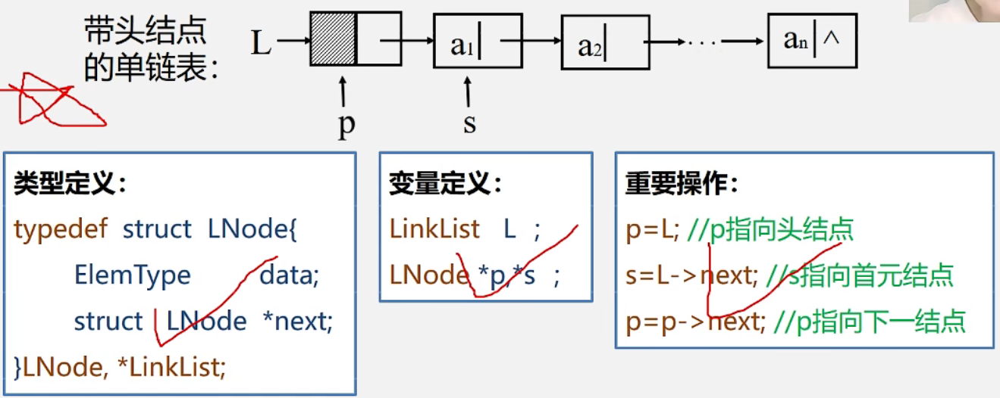
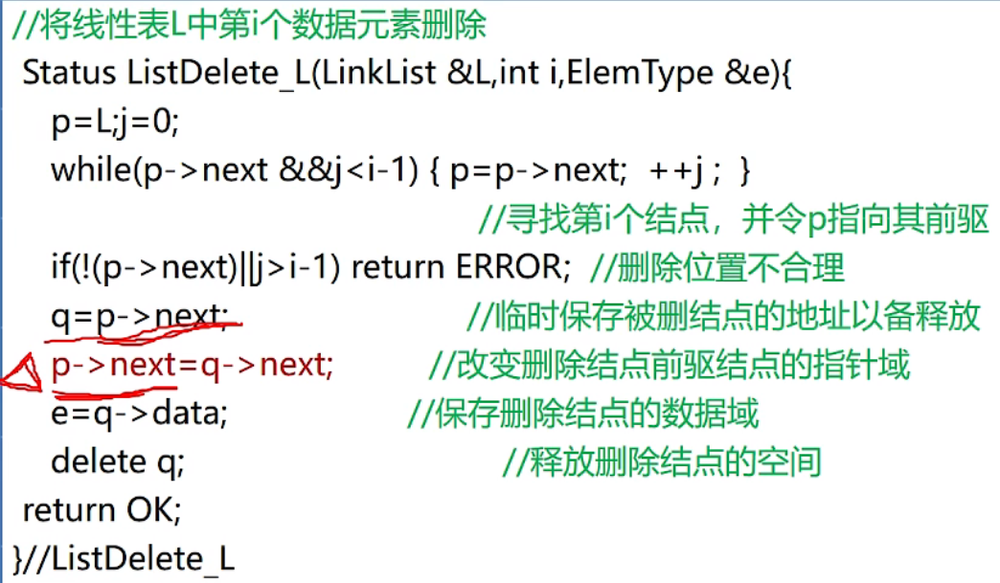
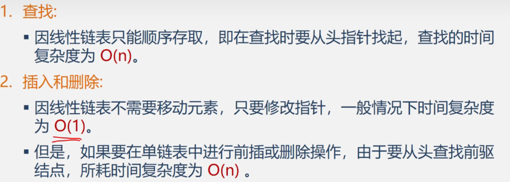

数据结构——单链表的基本操作
==============

> 销毁单链表

> \[补充算法\]清空单链表

链表仍然存在将其置空(头结点和头指针仍然存在)  

> \[补充算法\]求表长

\[算法思路\]从首元结点开始依次计数直至最后一个元素

> ==总结：常用操作  
> 指向头结点 p=L;  
> 指向首元结点p=L->next;i=1;  
> 指向下一结点p=p->next;==

链表不是随机存取结构

\[算法步骤］①用指针p指向首元结点，用j做计数器初值赋为1。②从首元结点开始依次顺着链域next向下访问，只要指向当前结点的指针p不为空(NULL), 并且没有到达序号为i的结点，则循环执行以下操作：

• p指向下一个结点；• 计数器j相应加1。

③退出循环时，如果指针p为空，或者计数器j>i,说明指定的序号i值不合法大于表长n或小于1), 取值失败返回ERROR;否则取值成功，此时j=i时，p所指的结点就是要找的第l个结点，用参数e保存当前结点的数据域，返回OK。

> \[算法2.8\]单链表的按值查找——根据特定数据获取该数据所在地址

算法步骤1.从第1个节点依次与e比较  
2.如果找到一个与e值相等的数据，则返回在列表中的地址  
3.如果查遍整个链表都没有找到和一直相等的元素停止循环返回0/NULL

\[算法分析］该算法的执行时间与待查找的值e相关， 其平均时间复杂度分析类似于算法2.7,也为O(n)。

> \[算法2.9\]单链表的插入

思考步骤①②能互换吗？
直接换顺序执行②找不到后继ai结点了
先用p指向ai-1结点再用用q指针指向ai结点

> \[算法2.10\]删除第i个结点

\[算法步骤\]1.找到第i-1个结点,如果有必要的话保存ai的值且将地址存于在q中以备释放

2.找到ai+1的位置赋值给，ai-1的next域

3.释放ai

  

p->next = p->next->next;

  

[算法分析] 

