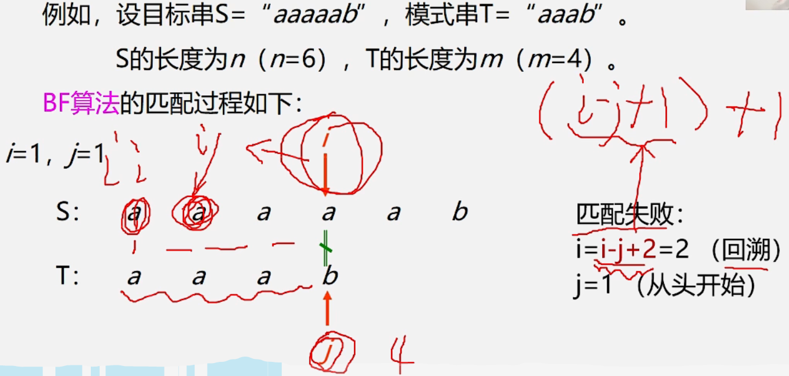
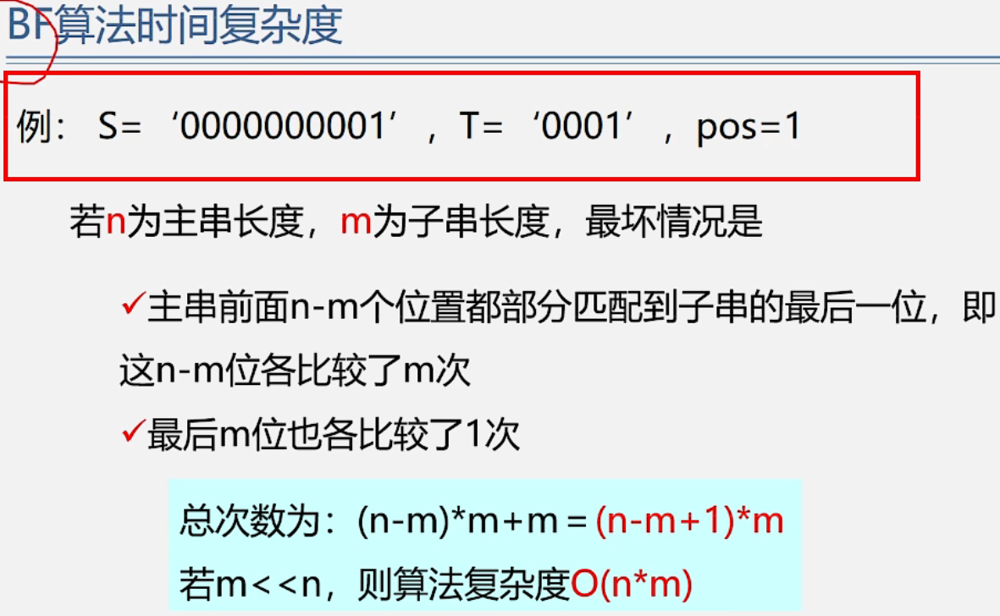

数据结构——BF算法
==========

串的模式匹配算法
========

算法目的：确定主串中所含子串(模式串)第一次出现的位置(定位)

有用的算法如文章中查找关键字、搜索引擎、拼写检查、语言翻译、数据压缩  

串的模式匹配算法——BF算法
==============

Brute-Force简称BF算法(简单匹配算法)采用穷举法的思路  

返回i-T.length的位置

  

  
