# KMP算法

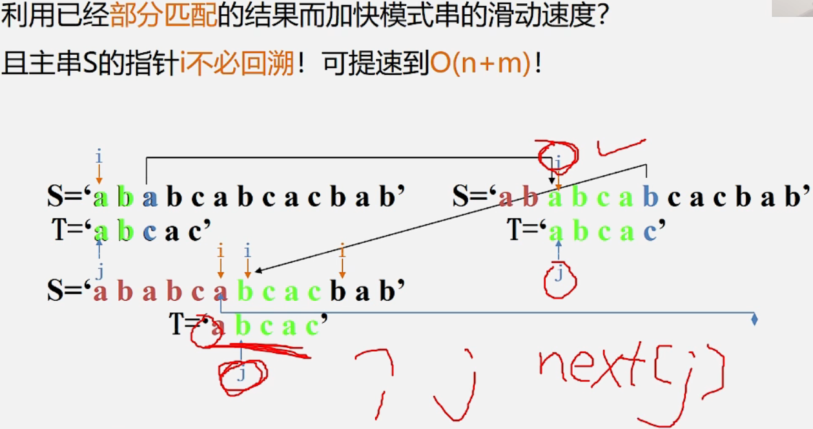

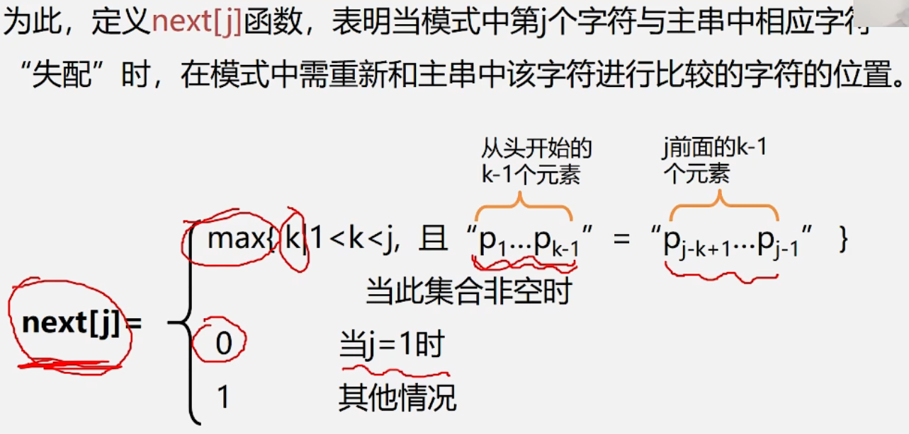

前缀

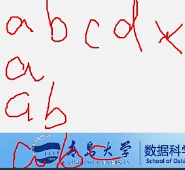

后缀

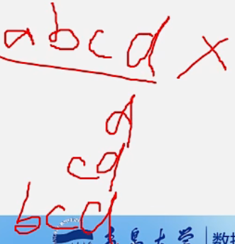


k-1是1，所以k是2

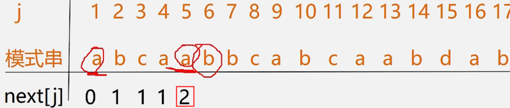


k-1是2，所以k是3

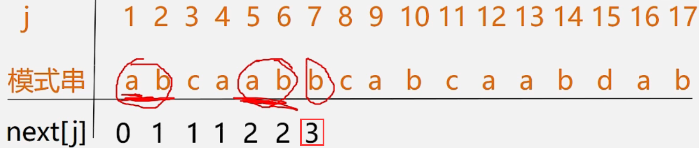


最终结果

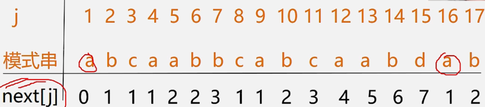


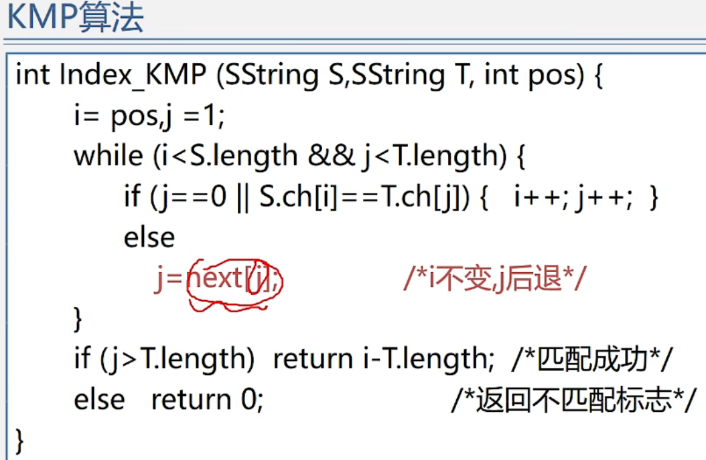

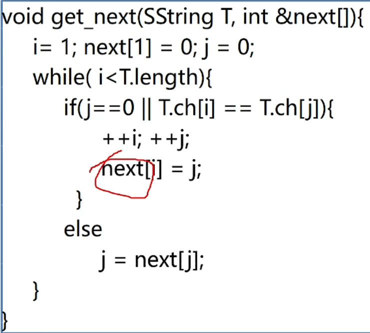

j=4，a字符跟b字符不匹配，那p串中与a相同的字符跟b也肯定不匹配

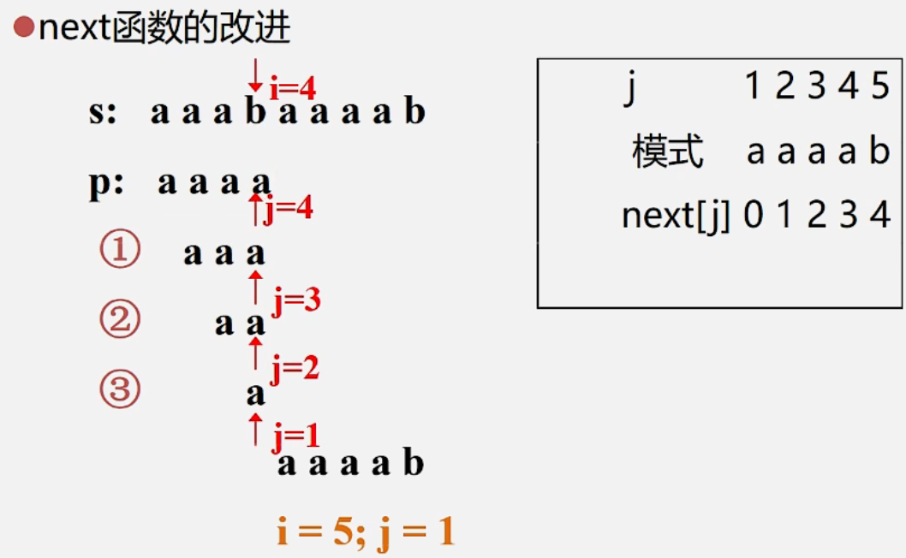

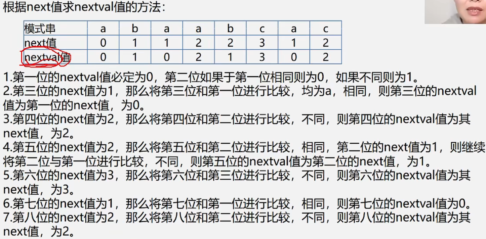


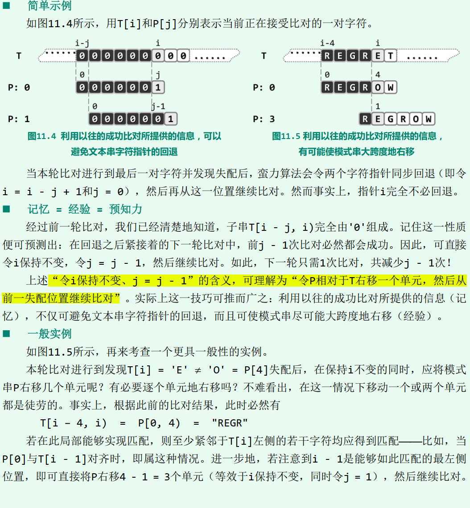

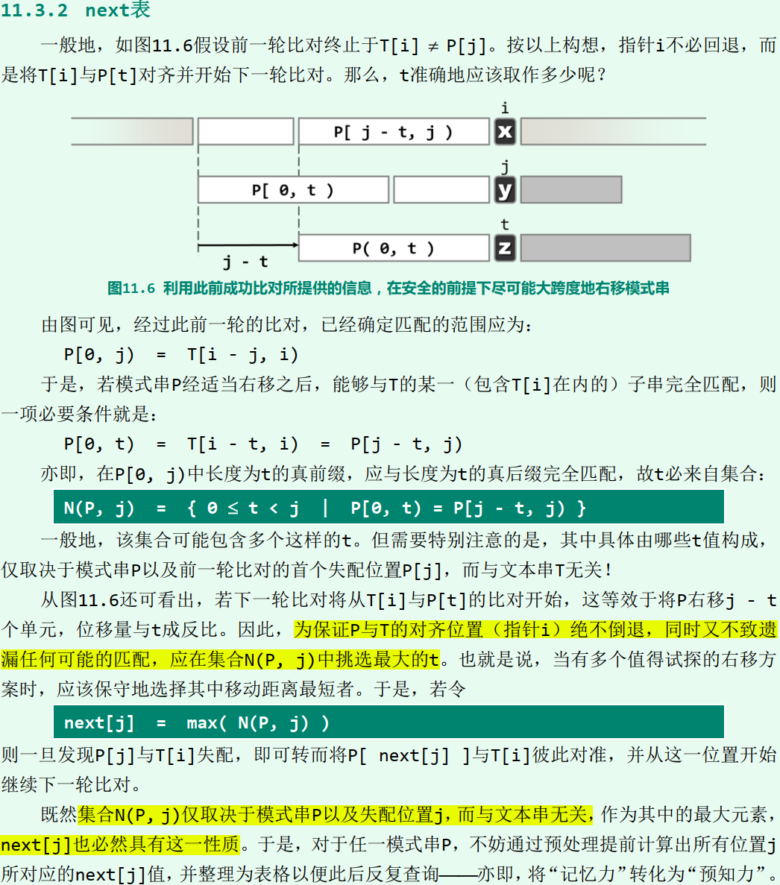

```cpp
int match ( char* P, char* T ) { //KMP算法
	int* next = buildNext ( P ); //极造next表
	int n = ( int ) strlen ( T ), i = 0; //文本串指针
	int m = ( int ) strlen ( P ), j = 0; //模式串指针
	while ( j < m && i < n ) //自左向右逐个比对字符
		if ( 0 > j || T[i] == P[j] ) //若匹配，或P已移出最左侧（两个判断的次序不可交换）
			{ i ++; j ++; } //则转到下一字符
		else //否则
			j = next[j]; //模式串右秱（注意：文本串丌用回退）
	delete [] next; //释放next表
	return i - j;
}
```

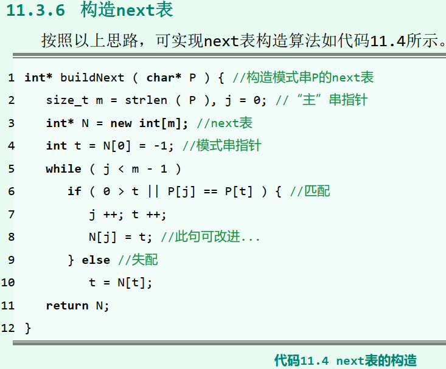

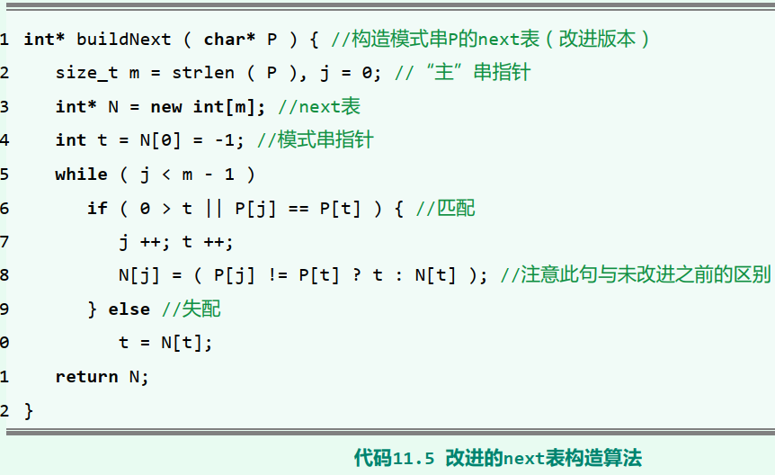