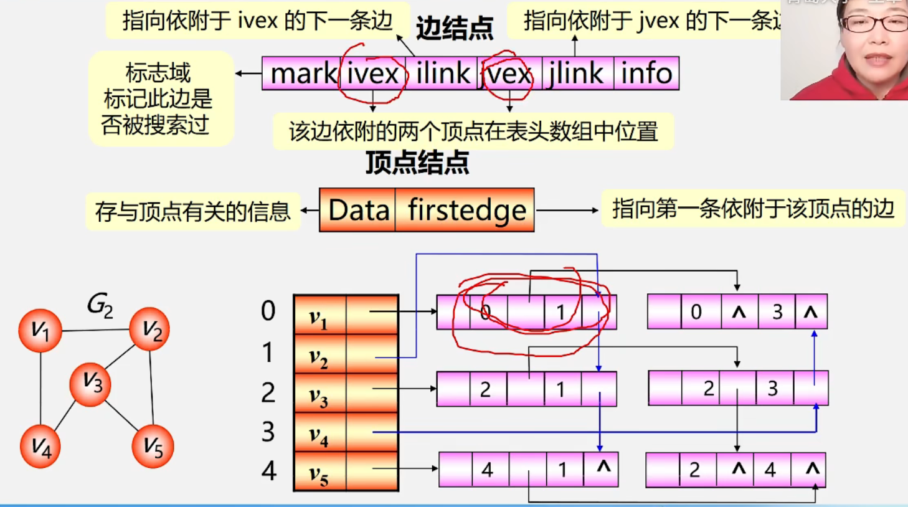

数据结构——图的存储结构
============

链式：图有多个前驱和多个后继需要多个指针域，但图不像线性表一个前驱一个后继用pre和next两个域(双向链表)，二叉树一个前驱两个后继用lch和rch(二叉链表)，有必要时候可以增加parent(三叉链表)，图前驱和后继数量不确定(重点介绍邻接矩阵和邻接表)

**复习**：()无方向不区分起始端点和终止端点<>有向i（弧尾）-->j(弧头)i出发指向j

邻接表示两个顶点之间的关系：(有边/弧相连的两个顶点之间的关系)

特别：完全图的邻接矩阵中，对角元素为0，其余元素为1

w(weight)表示权重

Arc表示边的类型，如果有权(∞和权值)没有权则用0和1

(1)输入了顶点数和边数就可以确定输入一维数组的顶点信息和邻接矩阵的边的关系的循环次数

(3)涉及循环的嵌套(有行有列)如果有边将值改为权

G是函数的参数同时接受函数的返回值(函数直接对参数进行一些操作)

G有4个成员(2个数组、2个信息)

访问成员的方式 结构体变量名.成员名

指向结构体变量的指针名->成员名

链式法适合存储稀疏图

空间是O(n+2e)  

空间大小顶点数+边数(n+e)

根据实际用哪种操作比较多结合两种邻接表的特点选择

tailvex：弧尾的位置

headvex：弧头的位置

hlink:弧头相同的下一条弧

tlink:弧尾相同的下一条弧

