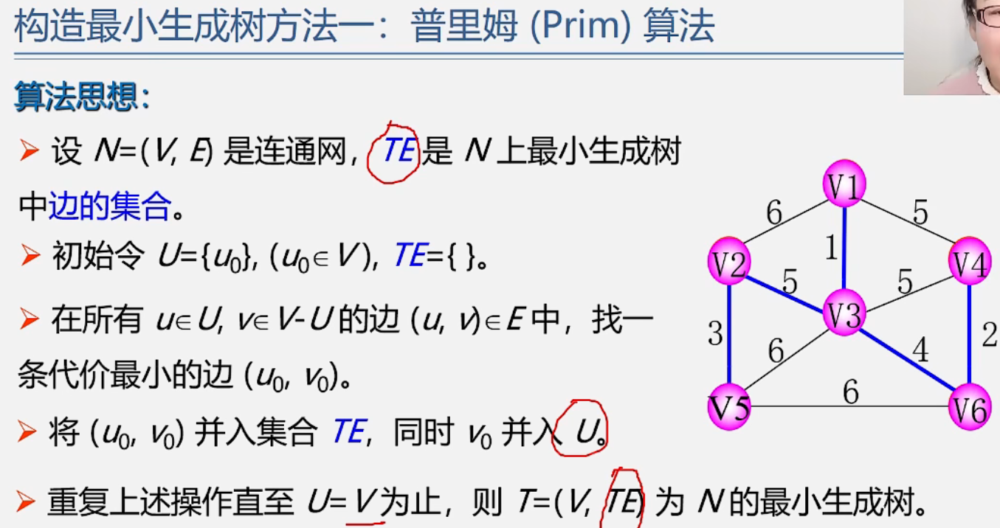

数据结构——图的应用1最小生成树
================

> 图的应用  
> 

该性质在严蔚敏的教材利用反证法证明

设u0=V1,U={V1} V-U=V2 ...V6在∨1V2,V1V3,V1V4中选择权值最小的边V1V3,把V3加入U V1V3加入TE

U={V1,V3},V-U={V2,V4,V5,V6}在V1V2,V1V4,V3V2,V3V4,V3V5,V3V6中,V3V6的权是4最小V6加入U,V3V6加入TE

U={V1,V3,V6},V-U={V2,V4,V5}在V1V2,V1V4,V3V2,V3V4,V3V5,V4V6,V5V6中V4V6权为2最小V4加入U,V4V6加入TE

U={V1,V3,V6,V4},V-U={V2,V5}边中V2V3权为5最小，V2加入U,V2V3加入TE

V2V5权为3最小 U=V结束

无论是prim还是Kruskal都是运用了MST性质(本质上贪心算法(每一步都选择最优这种算法战术上正确战略上有时有些欠缺)\[哈夫曼树好像也提过\])

  

把树的所有顶点都加入最小生成树的顶点集合中

每次找权最小的边(权从小到大排序)1 2 3 4 5 5 5 ...边的时候注意不能形成环。生成树连通无回路\[权为5的有2条会形成环\]

假设V5V6的权为5,可以在V2V3,V5V6中任选一条加入最小生成树

最小生成树可能不唯一
==========

**算法的实现老师没有介绍.**

  

