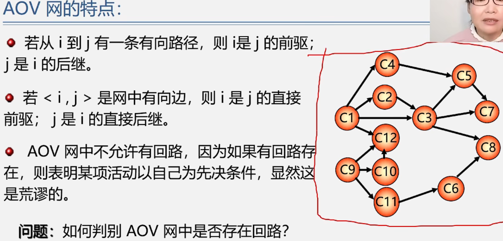

数据结构——拓扑排序+关键路径
===============

  

## **拓扑排序：**

1.在有向图中选择一个没有前驱的结点且输出它(C1,C9都可以这里以C1为例)

2.从图中删除该顶点及所有以他为尾的弧

3.重复上述两步直至全部顶点均已输出或图中不存在无前驱结点的顶点为止

## **关键路径**

  

**AOE网的抽象**

  

无论如何都要保证所有事情在规定时间完成

**求关键路径找关键活动(l(i)-e(i)=0)-->分别求l(i)和e(i) --求各个顶点的最早和最迟的发生时间**

  

  

关键路径的讨论：

  

  

  

