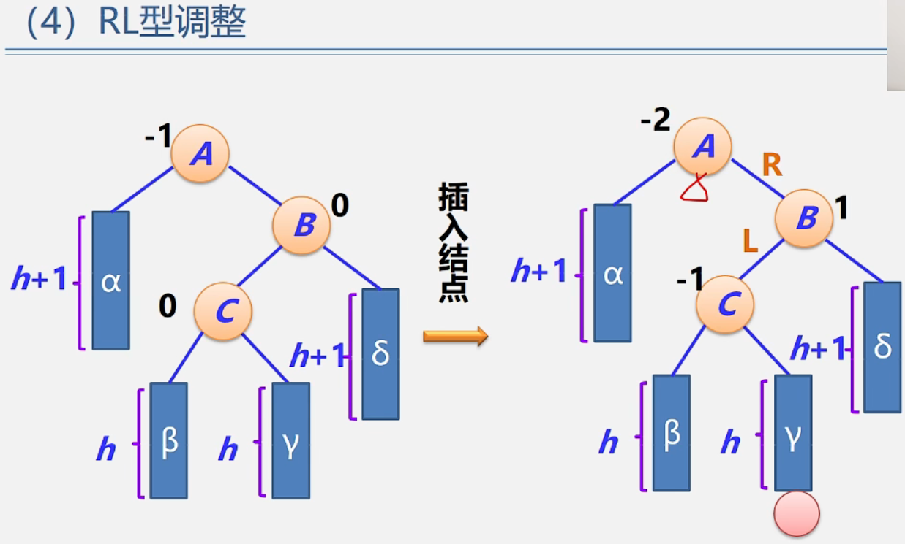

数据结构——树表平衡调整方法
==============

## **平衡调整方法1**

60比根结点大 插入到右子树 60比53大 插入到右子树 60比70小 插入其左子树

05:16

08:08

二叉排序树性质：左子树<根节点<右子树

## **调整方法2**

LL型删除的结点在左子树的左子树上

(把A转下来 平衡旋转)

  

01:45

01:47

01:54

02:16

04:18

2<5 左子树 2<4 左子树

04:38

调整方法——例题

两个失衡找最小失衡子树

  

