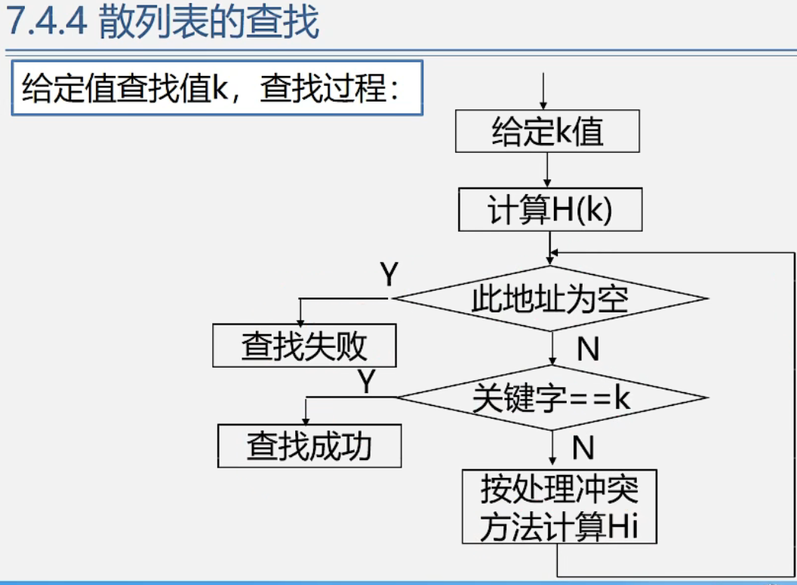

数据结构——散列表的查找
============

## **散列表的基本概念**

  

## **散列函数的构造**

  

## **处理冲突的方法**

### 开地址法

  

当前位置不行就增加1 加1不行就加2

查找11 11mod11 =0 先去0号位置 结果找到了

查找22 22mod11=0 先去0号位置 结果没找到 去1（0+1）号找 1号找不到去2(0+2)号找\[线性探测的增量是 1 2 3 ...\]

平均查找长度（1+2+1+1+1+4+1+2+2）/9（假设概率相同P=1/9）=1.67

地址对任何元素都开放（可用）

黑色字体 直接存

###   链地址法

除留余数法   

先构造散列表

查找方法 查找19 H(19)=19 mod 13 = 6

查找84 H(84)=84 mod 13 = 6 到6号位置上不是84 接着去7号也不是84 再去8号位置 是84 比较3次

红色字是找到这个元素需要比较的次数

平均查找长度：ASL=(1\*6+2+3\*3+4+9)/12=2.5

  

平均查找长度：ASL=(1\*6+2\*4+3+4)/12=1.75

但ASL感觉不是1

无序表：

有序表折半查找的ASL log2（n+1） - 1 =二点多

散列表上查找的ASL 如果完全没有冲突可能达到 O(1)

散列表的效率分析：

ASL取决于

散列函数：能否让关键字均匀的排列在散列表中

处理冲突的方法：

散列表的填装因子α(alpha): n=12 哈希表的长度=16 α=12/16 = 0.75

  

