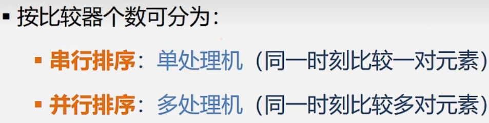

数据结构——排序概述
==========

## 8.1 排序概述

在数据库原理中 见过 数据域的概念的 二维表（关系）中的一列

比如针对学生信息表往往是按学号/姓名进行排序 

> 应用广泛

文件管理

Excel 表格

购物网站按销量、好评来排序

游戏的排行

冒泡排序、 快速排序、二分查找前提元素是有序的

排序方法是否稳定，并不能衡量一个排序算法的优劣。

1551

  

