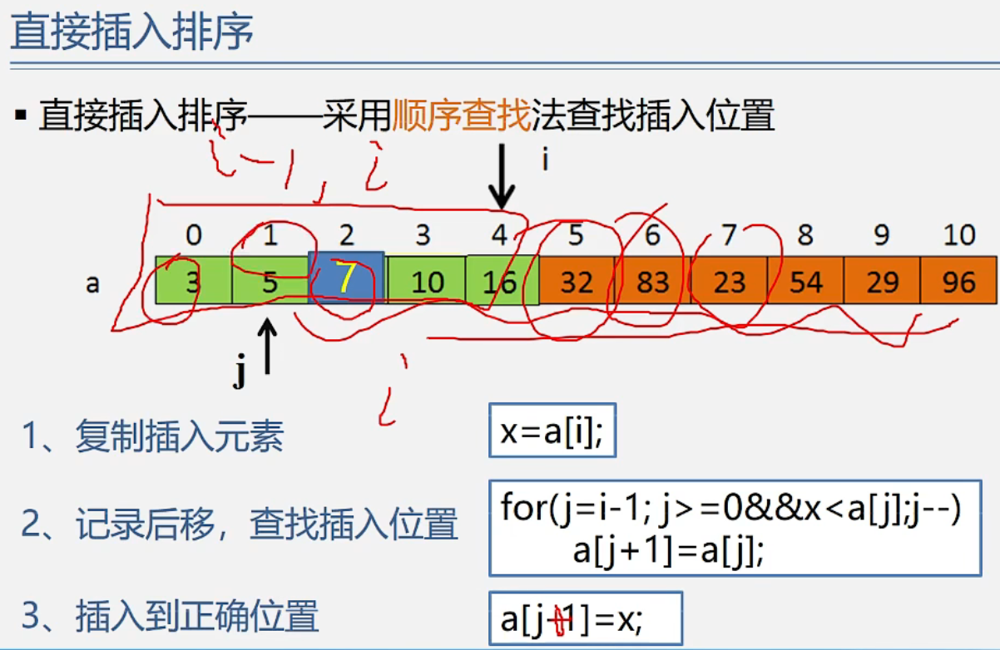

数据结构——插入排序
==========

插入排序1——————直接插入排序

> 插入排序的基本思想：
> ==========

  

**插入到前面中间后面是相当于已排序的元素而言的**

**如何找到插入的位置呢？**

**方法不同分成几类**

  

  

a0~a3是有序的 给a4找合适的位置 插入到有序序列中 应该插入到5后面 比插入的元素7大的10和16需要后移，而直接移会被覆盖，应该设置临时空间

1.  复制该元素 x=a\[i\]（a\[i\]的值赋给x）
    
2.  拿x和已经排好序的部分比较（从前往后可以，从后往前也可以 这里以从16开始往前为例）再设置应该变量j表示查找位置的下标，==j的初始值是i-1   a\[j\]>x，x插在a\[j\]之前，a\[j\]后移 a\[j+1\]=a\[j\] 然后 j--==
    

a\[j\]和x比较 10>7继续后移 j--    

 a\[j\]和x比较 5<7 =a\[j+1\]x a\[j\]<x停止比较

做相同或类似的事情用循环 反复做什么 什么时候停止 （循环变量 初值）j最小是0

x放在第一个元素

循环停止另一种情况（当插入元素x=2）比较了所有元素 比较的最后一个元素是a\[0\] 3>2 a\[j\]后移 j-- （此时j=-1   循环停止 j的值（-1）不满足循环条件 条件可以是j>=0）

for循环不满足条件循环停止

改成a\[j+1]=x

**第一个元素直接放在a\[0\]从第二个元素开始就要去找合适自己的位置 插入元素个数-1次 顺序查找法每次都要判断下标是否越界**

**可以类似的设置哨兵**

**算法的关键步骤：**

  

  **辅助空间与元素个数无关所以是O（1）**

  

  

  

  

  

