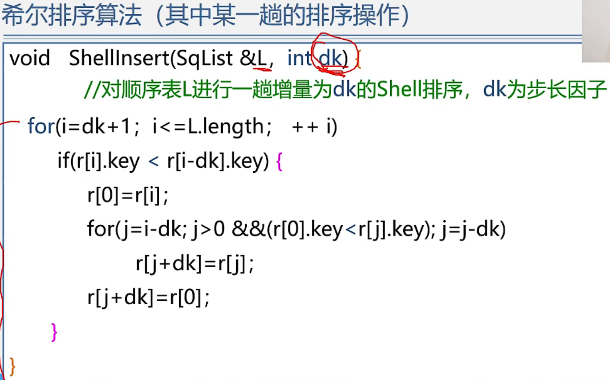

数据结构——插入排序2折半插入排序+希尔排序
======================

**插入排序:**把无序的元素插入到已经有序的元素组成的序列的合适位置

**直接插入排序:**把第i个元素保存到哨兵位置依次查找他插入的位置

以i-1开始比插入的值大向后移动，直到当前位置小于哨兵元素找到插入位置

查找位置是将无序的元素在有序的序列中找一个合适的位置插入到有序序列中

既然有序可以考虑用折半查找

用mid和哨兵比较 mid<哨兵在左半区查找，mid>哨兵在右半区查找

在确定插入位置的时候用的是折半查找 对应的插入排序称之为折半插入排序

> **折半插入排序----算法描述**
> ==================

> 性能分析
> ====

**折半查找--对数级 顺序查找--O(n)**

  

**希尔排序**
========

1  6 11分在一组  
移动一大步快速接近它的最终位置  
排序完成组内有序整体看来序列基本有序  
再进行3-间隔  1-间隔 直接插入排序

dk值依次存在data\[t\]中

**本质上还是直接插入排序只不过元素的间隔不是1修改的地方j--改为j=j-dk  移动的目的地对应修改**

希尔排序法是一种==不稳定==的排序算法

**链式不好找间隔为dk的元素还得一个个找，不如顺序查找**

  

