# 交换排序

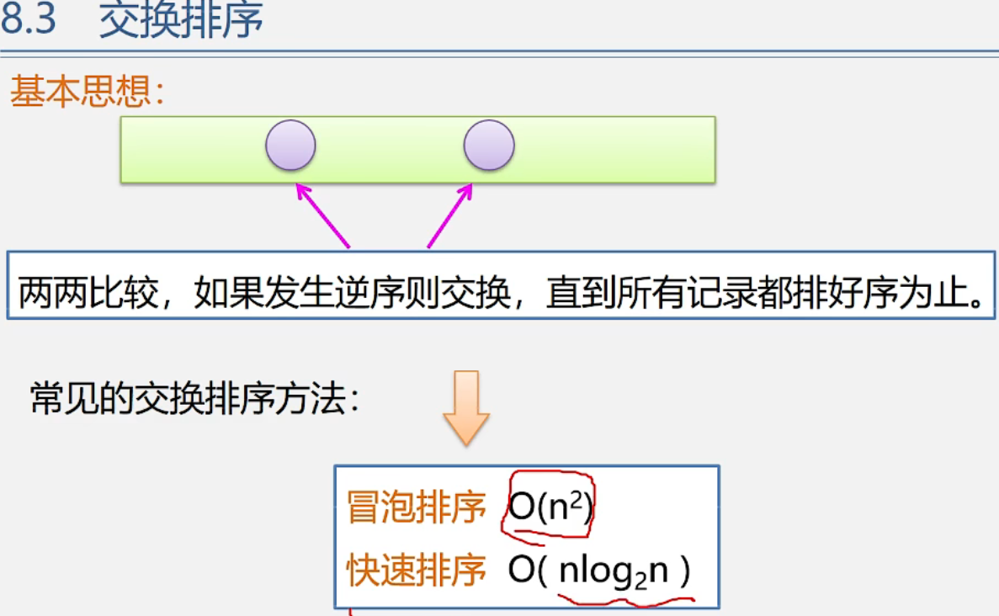

## 冒泡排序

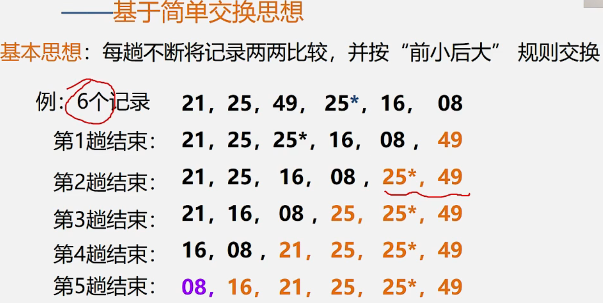

每一趟增加一个有序元素

==总结：n个记录 ，总共需要n-1趟；第m趟需要比较n-m次==

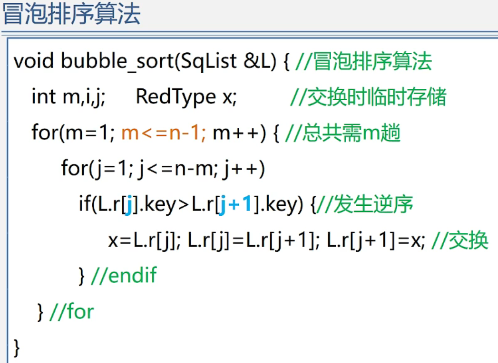


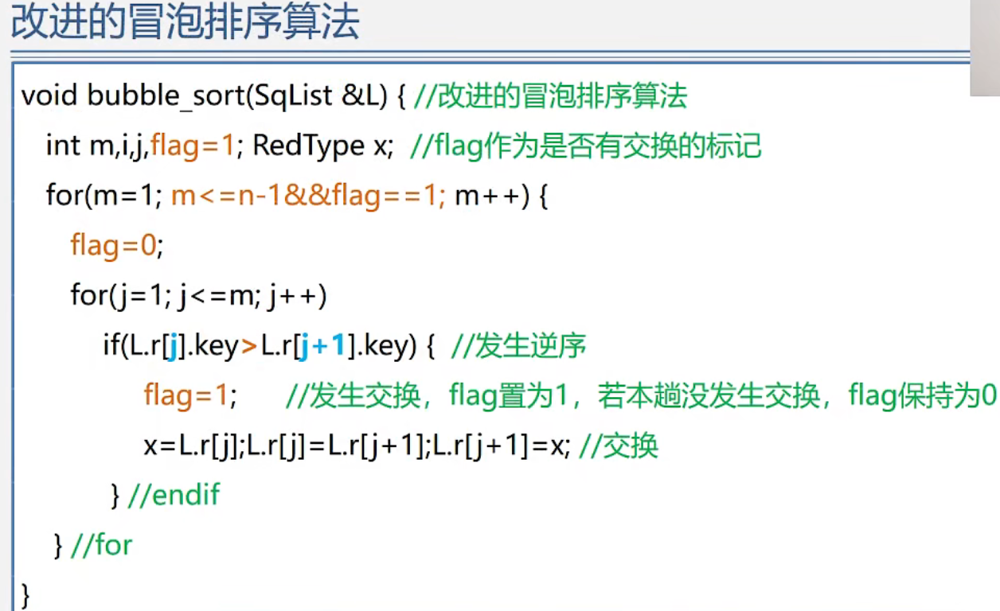


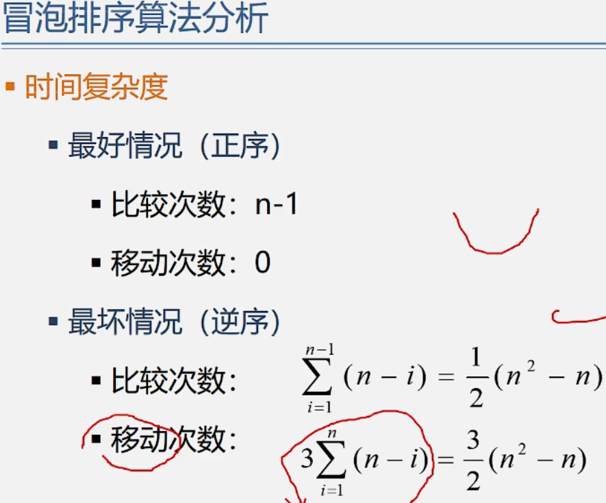

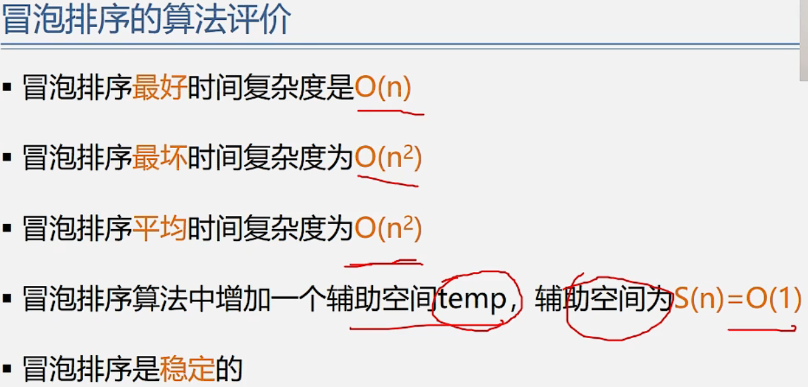

==冒泡排序是稳定的==

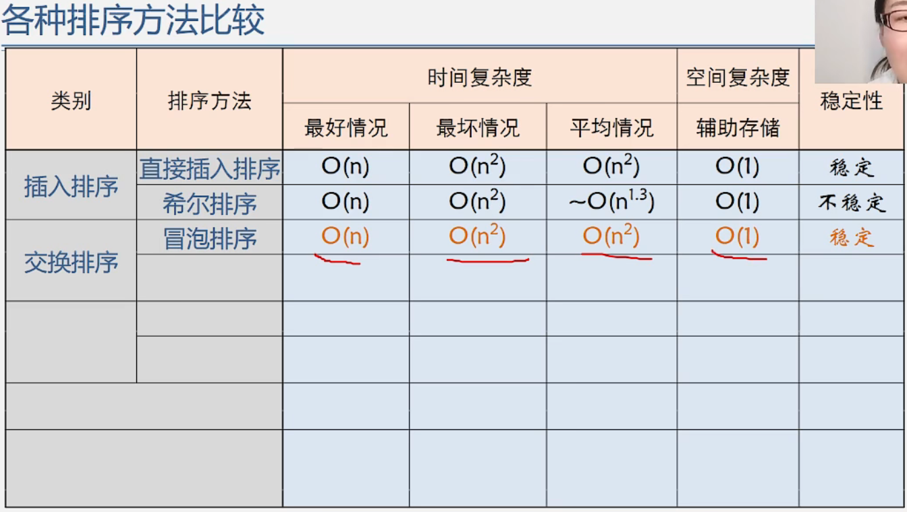

## 快速排序

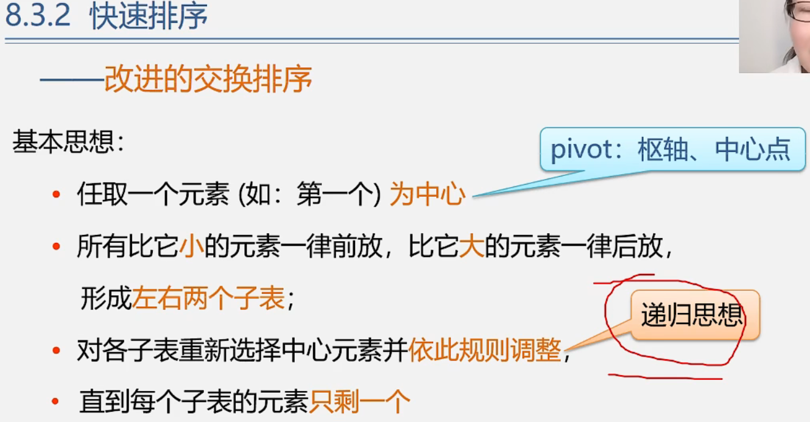

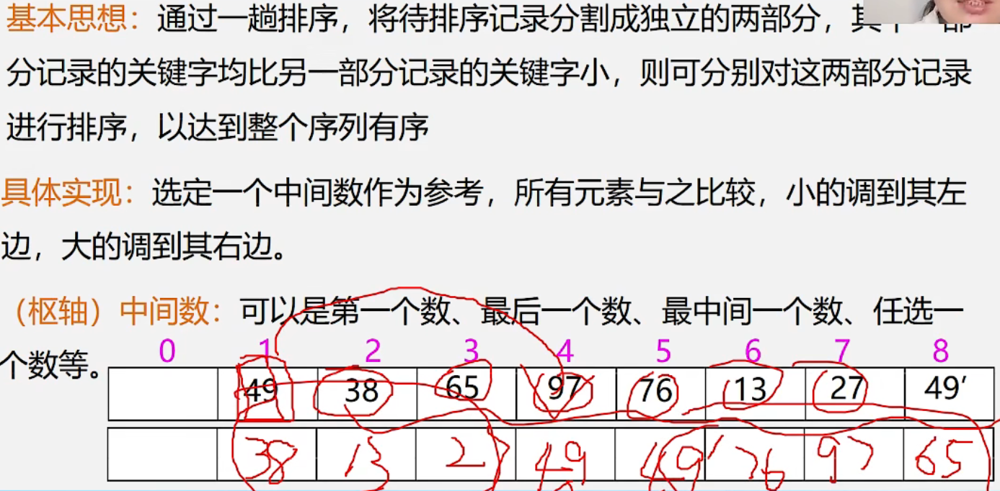

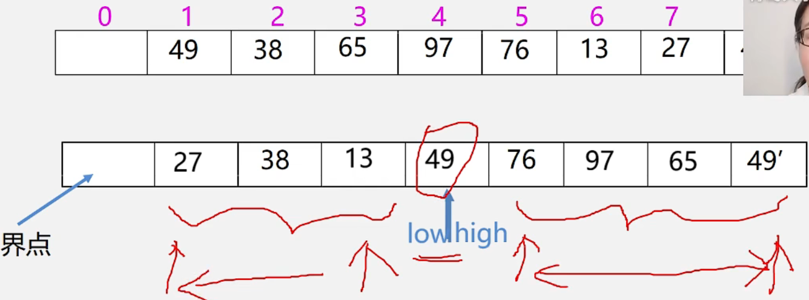

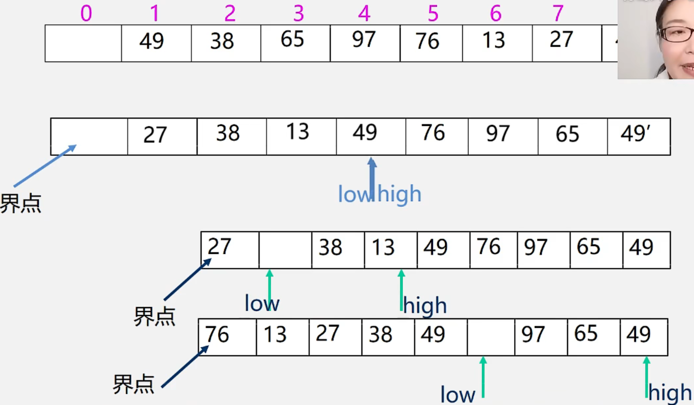

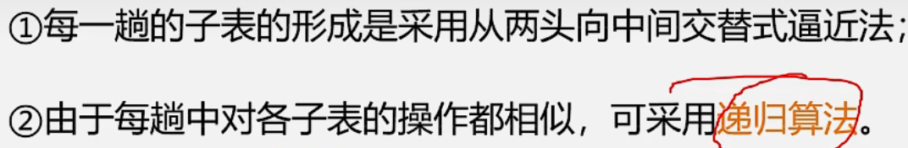

```cpp
//快速排序
//左闭右开
void quick_sort(vector<int>& nums, int l, int r) {
	//如果数组大小为1，则无需排序
	if (l + 1 >= r) {
		return;
	}
	//因为传入的是nums.size()所以要减1
	int first = l, last = r - 1, key = nums[first];
	//确定中心点位置为first
	while (first < last) {
		while (first < last && nums[last] >= key) {
			--last;
		}
		//从后往前，找到比key值小的数，搬到first的位置
		nums[first] = nums[last];
		while (first < last && nums[first] <= key) {
			++first;
		}
		//从前往后，找到比key值大的数，搬到刚才空出来的last的位置
		nums[last] = nums[first];
	}
	//把key值赋给first位，此时的first=last
	nums[first] = key;
	//对低子表递归排序
	quick_sort(nums, l, first);
	//对高子表递归排序
	quick_sort(nums, first + 1, r);
}
```

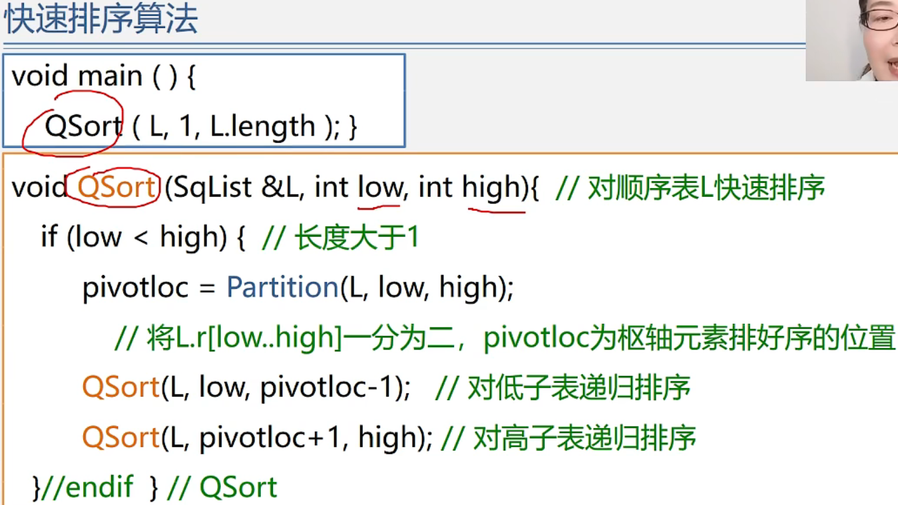

确定中心点

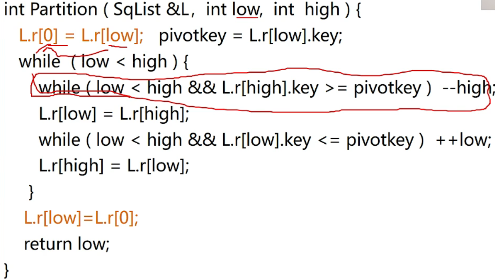

快速排序算法分析

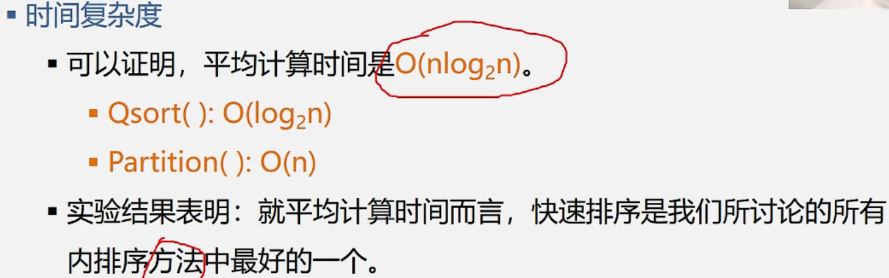


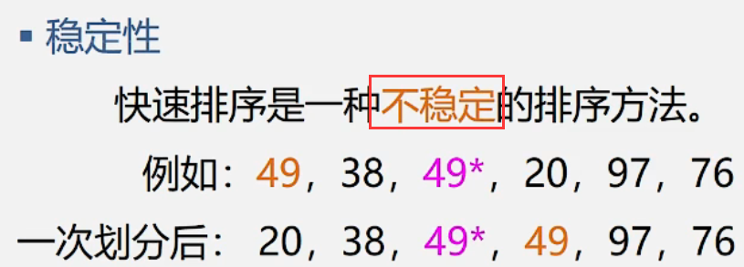

==快速排序是不稳定的==

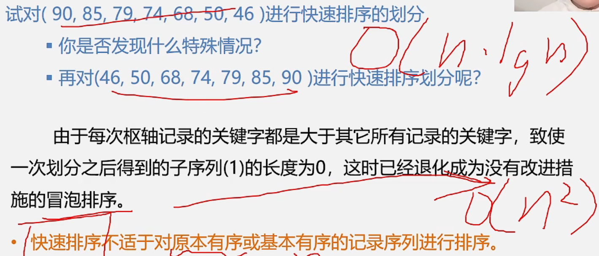

快速排序不适于对原本有序或基本有序的记录序列进行排序。

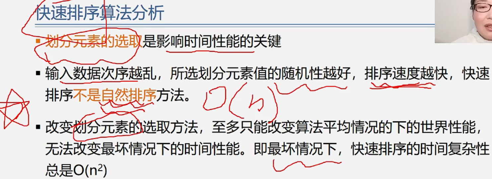

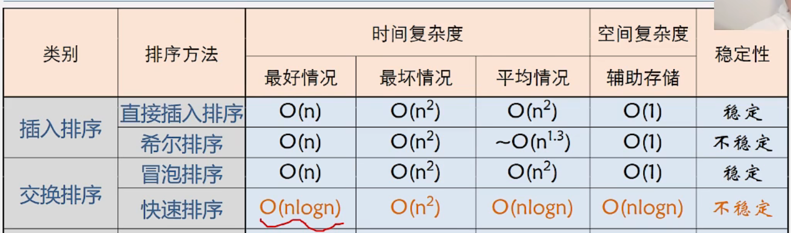

